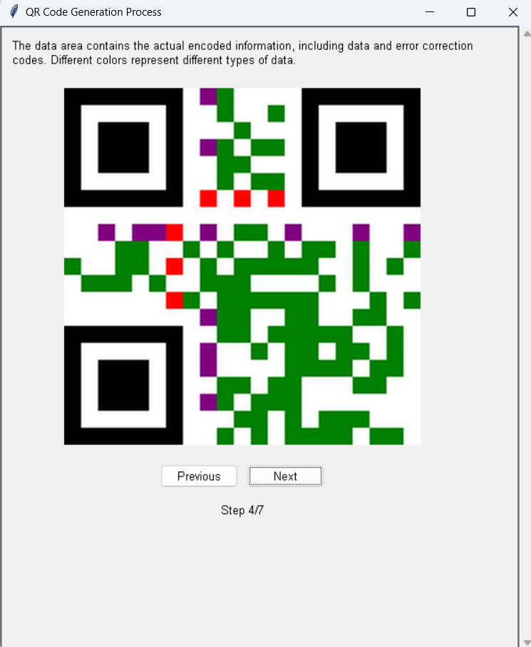
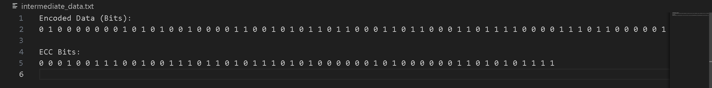
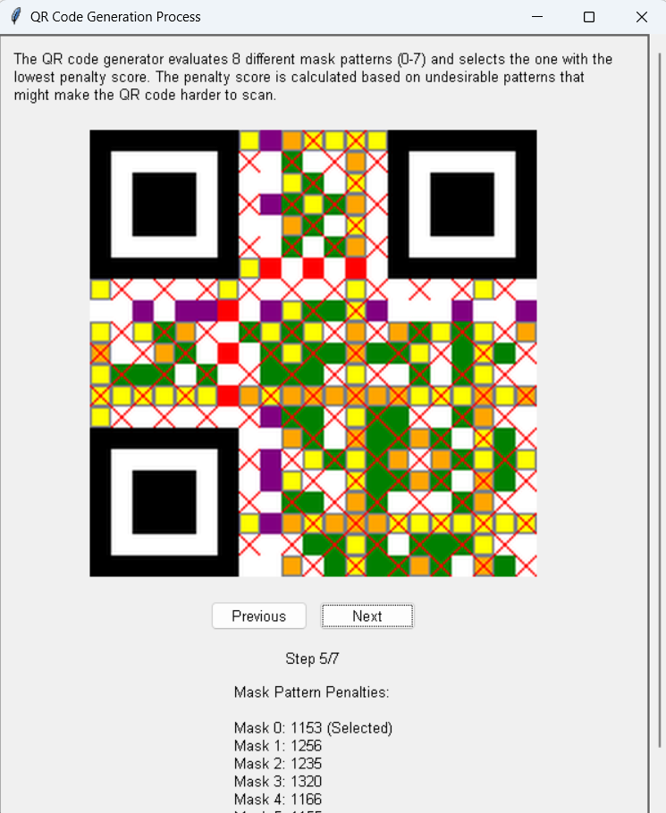
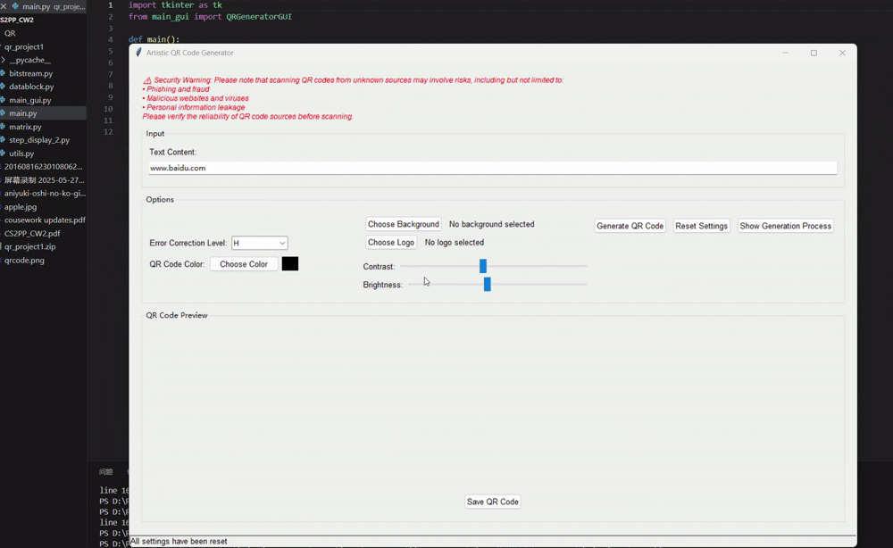

# QR_code_generator
A **graphical QR code generator** that enables users to easily create standard or artistic QR codes, with customization options and educational step-by-step visualizations of the encoding process

---

## Application Description and operation instructions

### Description

This project is a graphical QR code generator that supports users to input any string to generate standard or artistic QR codes. This application includes the step-by-step generation of visualizations and enhances the transparency of how data is encoded as QR codes. It offers a user-friendly interface that allows non-technical users to easily generate, customize, preview and save QR codes.

---

### Getting Started 

**Requirements**
- Python version **3.11.7**
- Install the necessary libraries in the terminal:
```bash
pip install pillow reedsolo amzqr
```
**Note:** The amzqr library is used exclusively as an additional feature to handle the GIF background for dynamic QR codes; it is not involved in the core QR code construction process.
- Run the application:
In the root directory of the project, run:
```bash
python main.py
```
---

### User Operations

1. **Launch the App**
   Run the main program:

   ```bash
   python main.py
   ```

2. **Input Text**
   Type the text or URL you want to encode into a QR code.

3. **Optional Settings**

   * Choose **error correction level** (L / M / Q / H)
   * Set **QR code foreground/background colors**
   * Upload a background image
   * Embed a **logo image** in the center
   * Adjust **contrast and brightness**
   * Restore to **default settings**

4. **Generate QR Code**

   * Click **"Generate QR Code"** to preview
   * Click **"Show Generation Process"** to visualize how the QR is built step-by-step

5. **Save QR Code**

   * Click **"Save QR Code"** to export the image as `.png` or `.gif`

---

### Project Structure
```plaintext
qr_project/
│
├── main.py             # Entry point for launching the GUI
├── main_gui.py         # Main GUI logic and interface
├── bitstream.py        # Handles bitstream processing for QR code generation
├── datablock.py        # Encodes user data into structured blocks
├── matrix.py           # Builds the QR matrix based on encoded data
├── step_display.py     # Visualizes the QR generation steps
└── utils.py            # Utility functions and error definitions
```
---

## Programming paradigms used 

This project utilizes a combination of imperative, functional, and object-oriented programming paradigms to achieve its goals. Below is a summary of how each paradigm has been applied throughout the codebase.

### **Object-Oriented Programming (OOP)**

Object-oriented programming is the primary paradigm used in this project. The code is structured around classes and objects that encapsulate related data and behaviors. This approach provides a clear modular structure and promotes code reuse.

- **Classes and Objects**: The project defines several classes such as `QRDataBlock`, `QRMatrix`, `QRGeneratorGUI`, and `QRStepDisplay`. Each class represents a distinct entity with its own attributes and methods.
- **Encapsulation**: Data is encapsulated within classes, and access to this data is controlled through public methods. For example, `QRMatrix` class encapsulates the data and functionality related to generating QR codes.
- **Inheritance**: While not explicitly used in the provided code, inheritance could be utilized to extend the functionality of existing classes.
- **Polymorphism**: Methods such as `get_module` in the `QRMatrix` class demonstrate polymorphism by providing a unified interface to access different types of data within the QR code. Broadly speaking, this reflects a kind of polymorphism.

### **Imperative Programming**

Imperative programming is used to describe the algorithms and the step-by-step procedures for performing tasks.

- **Procedural Code**: Functions like `make_segments` in `QRDataBlock` and `draw_function_patterns` in `QRMatrix` contain imperative logic that describes the sequence of operations needed to execute a task.
- **Control Structures**: The code extensively uses control structures such as loops (`for`, `while`) and conditionals (`if`, `else`) to execute code based on certain conditions or to repeat actions.
- **Procedural Instructions**: The `generate_qr` method in `QRGeneratorGUI` is a good example of imperative programming, where it provides a sequence of steps to generate a QR code.

### **Functional Programming**

Functional programming concepts are used to enhance the code's readability and maintainability, especially in handling data transformations and collections.

- **First-Class Functions**: Functions like `choose_color` and `choose_background` in `QRGeneratorGUI` are passed as parameters to other functions, demonstrating that functions are treated as first-class citizens.
- **Pure Functions**: The `_get_bit` function in `utils.py` is a pure function that takes inputs and returns outputs without causing side effects.
- **Data Immutability**: The `BitStream` class in `bitstream.py` uses a list to store bits, which can be considered immutable since it is extended rather than modified in place.
- **Higher-Order Functions**: The use of `map`, `filter`, and `reduce` is not explicitly shown in the provided code, but these could be used to process data in a functional style.

In summary, the project effectively combines these programming paradigms to create a robust and flexible application. Object-oriented programming provides the structure, imperative programming provides the control flow, and functional programming principles help in managing data and operations more effectively.

---

## Real-World Applications
### Application in Marketing and Product Information Acquisition Scenarios
It is suitable for scenarios such as marketing campaigns and quick access to product information. It provides a simple and intuitive GUI or website, allowing users to quickly input information and generate QR codes without complex operations.

### Application in Inventory and Logistics Scenarios
It is applicable to scenarios like inventory management and logistics tracking that require high reliability and data integrity. Multiple masking patterns are used to ensure that the QR code can be scanned correctly even if it is damaged or blocked. This improves the fault tolerance of QR codes in practical applications, ensures reliable reading by scanners, and adapts to possible environmental interferences.

### Brand Enhancement in Marketing Campaigns
It is suitable for marketing campaigns and helps brands enhance brand recognition. Users are allowed to customize the appearance of QR codes, including color, module shape, and size. This increases the personalization of QR codes, enables combination with brand design, adds visual appeal, and strengthens brand influence.

### Security Risk Prevention
It prevents users from accidentally scanning malicious QR codes. When generating QR codes, users are alerted to potential security risks (such as phishing websites). This raises users' security awareness and reduces risks caused by malicious QR codes, especially in environments where QR codes need to be frequently generated and shared.

### Application in Advertising and Product Tracking Scenarios
It is suitable for scenarios such as advertising and product tracking that require high efficiency in information transmission. The optimal masking pattern is evaluated and selected to optimize the readability of QR codes in different environments, ensuring that QR codes can be scanned quickly and accurately in various environments, and enhancing the information transmission efficiency and user experience.

## Functionality Proof with Test String

### Test String: "Hello"
For a Version 1 QR code (21x21 matrix) with error correction level L, the following intermediate steps validate functionality:
#### - **Encoding**: "Hello" 

#### - **Error Correction**: Data is split into blocks, with 7 data codewords and 7 ECC codewords added.

#### - **Matrix Construction**: Finder patterns, alignment patterns (1 at center), and timing patterns are drawn. Data and ECC are filled into the matrix.
#### - **Masking**: Mask 0 is applied (e.g., (x + y) % 2 == 0), optimizing readability.

#### - **Final Output**: The resulting QR code is scannable, decoding back to "Hello".


## Demonstration
### This is a demonstration of the QR code generation process.
### The first one is a simple QR code, the second one is a dynamic QR code.
### The QR code results are in the folder `./generateQR`, you can use your phone to scan them!



